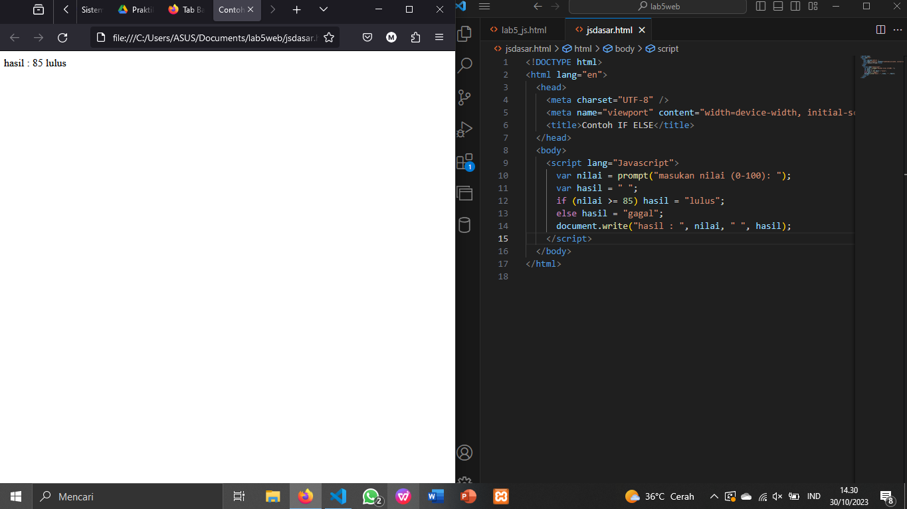

# Praktikum 5

## 1. Console Log dan Document Write

## 2. Alert Box

## 3. Penggunaan Method Dalam Objek

## 4. Pemakaian Prompt

## 5. Membuat Fungsi dan Memanggilnya

## 6. Operasi Aritmatika

## 7. Pengkondisian If-Else

## 8. Penggunaan Operator Switch Untuk Seleksi Kondisi

## 9. Form Input

## 10. Form Button

## 11. Dom Menggunakan Check Box

# Pertanyaan

## 1. Buatlah Script Untuk Melakukan Validasi Pada Isian Form

